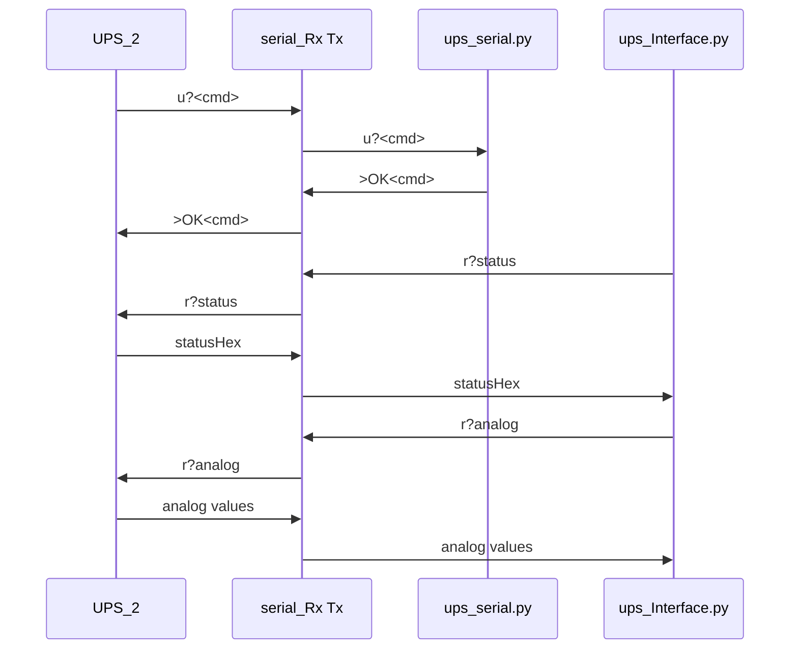

# testproject
learning github

change#1

```mermaid
sequenceDiagram
    participant ups as UPS_2
	participant int as serial_Rx Tx
    participant ser as ups_serial.py
    participant py as ups_Interface.py
    ups->>int: u?<cmd>
    int->>ser: u?<cmd>
    ser->>int: >OK<cmd>
    int->>ups: >OK<cmd>
    py->>int: r?status
    int->>ups: r?status
    ups->>int: statusHex
    int->>py: statusHex
    py->>int: r?analog
    int->>ups: r?analog
	ups->>int: analog values
    int->>py: analog values
```
